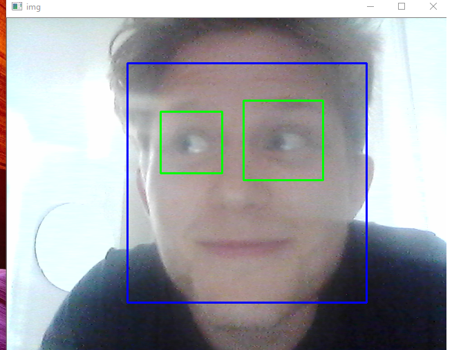

## Computer Vision

This repo contains some code for some computer vision tutorials Ive followed for fun for preperations of fun projects using this techology



### Getting started

1. Get a python env running with opencv and numpy
  - ``` $ virtualenv venv ```
  - ``` $ pip install opencv-python```
2. Download the [cascades](https://github.com/opencv/opencv/tree/master/data/haarcascades) to the repository
3. Have a webcam
4. Run the code!
